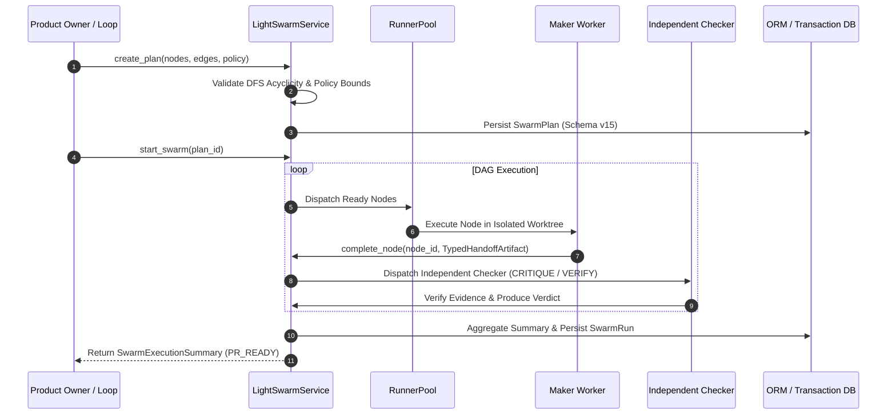

# LocalForge OS

# LocalForge OS

LocalForge OS is an open-source, economy-aware AI software engineering control
plane. It turns product specifications (PRDs) into sprint backlogs, routes work
across a specialized agent squad, executes tasks in isolated Git worktrees,
validates outputs through deterministic gates, performs bounded self-healing,
and prepares pull requests for human review.

Current status: **V6.2.0 Stable Release**. Fully compliant post-merge quality loop, 10-role engineering squad, zero-API multi-platform research (Agent-Reach), UI/UX Pro Max design system, Cline/Kanban worktree isolation, system prompt versioning & 1-click rollback, and executive release dossier automation.

The V6 target contract and architectural specifications are documented in
`docs/LocalForge_OS_PRD.md`, `docs/MASTER_BACKLOG_V6.md`, and

| Autonomy Level | Name | Allowed Operations | Human Requirement |
| --- | --- | --- | --- |
| **L0** | Manual | Inspect and propose actions; no automatic execution | Human triggers every step |
| **L1** | Inspect & Report | Inspect issues, PRs, and CI state; produce prioritized report | Zero repository or external mutations |
| **L2** | Draft-PR Workflow | Create isolated worktrees, fix allowlisted regressions, submit draft PRs | **Human review and merge required** |
| **L3** | Autonomous | Run continuous loops, create draft PRs, manage retry budgets | **Human review and merge required** |

> ⚠️ **CRITICAL SAFETY INVARIANT**: LocalForge agents will NEVER execute `git push --force`, merge directly to `main`, weaken failing unit tests, or bypass configured circuit breakers.

---

## 🔄 Supported Operational Loops

LocalForge OS V6 delivers three initial operational loops:

### 1. Daily Project Triage (L1)
- **Mode**: Report-Only (0 external mutations, $0.00 LLM cost on first-pass triage).
- **Function**: Inspects open issues, pull requests, and CI state.
- **Safety**: Deterministic triage neutralizes malicious prompt injections (`IGNORE_AND_LOG`) without policy escalation. Preserves `acting_on` idempotency state across restarts.

### 2. CI Sweeper (L2)
- **Mode**: Draft-PR Workflow.
- **Function**: Classifies CI failures into `CODE_REGRESSION`, `FLAKE`, `ENVIRONMENT`, `CONFIG`, `DEPENDENCY`, `UNKNOWN`.
- **Safety**: Automatically repairs **only** allowlisted `CODE_REGRESSION` failures in an isolated worktree under a max 3-attempt circuit breaker limit. Never weakends or deletes failing tests.

### 3. PR Babysitter (L2)
- **Mode**: Draft-PR Workflow.
- **Function**: Monitors PR review comments, requested changes, and mergeability.
- **Safety**: Deduplicates events, applies allowlisted small fixes, revalidates evidence when the upstream branch changes, and escalates merge conflicts without silent overwrites. Strictly prohibits self-approval or self-merge.

---

## ⚡ Swarm Execution Flow (Light Swarm)

The **Light Swarm Execution Engine** executes task plans as bounded Directed Acyclic Graphs (DAGs):



---

## 📊 Phase 11 Historical Evaluation Claims

The original Phase 11 report published the following controlled-fixture
strategy comparison. These values are **historical claims under compliance
review**, not current release evidence, until V6.1 regenerates them from
observed task-level runs and validates the immutable evidence chain.

| Execution Strategy | PR_READY Rate | Recall | Execution Duration | Total Token Cost | Gate Verdict |
| --- | --- | --- | --- | --- | --- |
| **Single-Worker V5 Baseline** | 0.60 | 0.80 | 1200 ms | $0.4500 | `PARTIAL` |
| **Loop Single-Worker** | 0.80 | 0.95 | 800 ms | $0.3000 | historical `ACCEPTED` |
| **Loop Light Swarm** | **0.95** | **1.00** | **650 ms** | **$0.2500** | historical `ACCEPTED` |
| **Loop Deep Swarm (Experimental)** | 0.85 | 0.90 | 1800 ms | $0.8500 | `PARTIAL` |

> 📌 **NOTE**: The V6.1 compliance path is historical disputed evidence in
> `docs/e2e/v6_1_compliance/`. Deep Swarm remains explicitly gated by measured
> evidence and decision contracts before production use.

---

## 🚀 Quickstart & Usage

### Prerequisites
- Python 3.11+
- Node.js 18+
- Git 2.40+

### Installation

```bash
# Clone the repository
git clone https://github.com/Masteradilio/local_forge_os.git
cd local_forge_os

# Install Python dependencies in virtualenv
python -m venv .venv
source .venv/bin/activate  # On Windows: .venv\Scripts\activate
pip install -e ".[dev]"

# Install Frontend dependencies
npm install --prefix frontend
```

### Running the Control Plane

```bash
# Initialize database/workspace through the supported CLI wrapper
python manage.py setup-backend

# Run backend API server
python manage.py run-backend

# Run frontend UI
npm run dev --prefix frontend
```

### CLI Quickstart

```bash
# Run L1 Daily Project Triage (report-only, 0 cost)
localforge loops-eval triage

# Run L2 CI Sweeper auto-repair on a build failure
localforge loops-eval ci-sweeper --build-id 101

# Run strategy comparison matrix
localforge loops-eval compare

# Inspect provenance-aware memory facts
localforge memory list --project-id 1

# Manage Light Swarm execution
localforge swarm status --run-id 1
```

---

## 🧪 Validation & Regression Suite

Run targeted validation commands during development:

```bash
# Run backend Pytest suite (276+ tests)
python -m pytest backend/tests -q

# Run static type checker
python -m mypy backend

# Run frontend Vitest unit tests (5/5 tests)
npm test --prefix frontend

# Run frontend production build validation
npm run build --prefix frontend
```

---

## 📄 Key Documents

- `docs/LocalForge_OS_PRD.md` — Product Requirements Document
- `docs/MASTER_BACKLOG_V6.md` — Historical V6 Engineering Backlog
- `docs/compliance_backlog_V6.md` — V6.1 Compliance Closure Backlog
- `CHANGELOG.md` — Implementation History
- `docs/e2e/v6/phase_11/acceptance_report.md` — Historical Phase 11 report
- `docs/e2e/v6/v6_release_summary.json` — Historical V6 release summary
- `docs/e2e/v6_1_compliance/` — Historical disputed V6.1 compliance evidence
- `docs/e2e/v6_2_compliance/` — V6.2 remediation evidence
