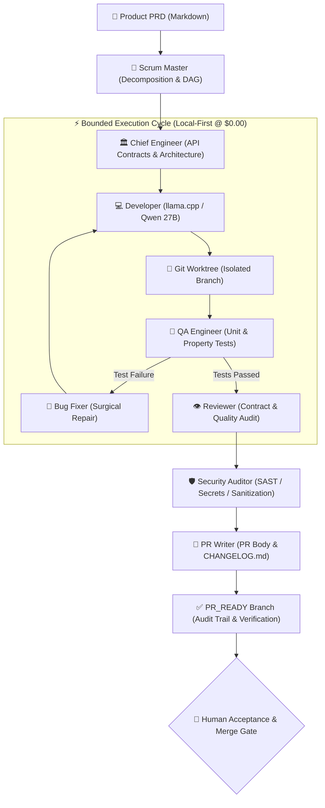

# Squad Forge SE — Autonomous AI Software Engineering Squad & Control Plane

<p align="center">
  
  
  
  
  
  
</p>

<p align="center">
  <b>Language Navigation / Navegação de Idioma:</b><br>
  <a href="#-english-en-us">🇺🇸 <b>English (EN-US)</b></a> &nbsp;|&nbsp;
  <a href="#-português-pt-br">🇧🇷 <b>Português (PT-BR)</b></a>
</p>

---

## 🇺🇸 English (EN-US)

### Executive Summary

**Squad Forge SE** is an enterprise-grade, local-first autonomous software engineering control plane. It turns any product specification (Markdown PRD) into bounded task contracts, isolated Git worktrees, deterministic AST validation, regression test suites, automated security audits, and human-reviewable `PR_READY` branches.

Engineered with an **Economy-First & Local-First** architecture, Squad Forge SE prioritizes local open-weights LLMs via `llama.cpp` (e.g. `Qwen 3.8 27B` / `Qwen 2.5 Coder 27B`) delivering **$0.00 USD cloud inference cost**, with an automated multi-tier fallback ladder to OmniRoute, OpenRouter, and NVIDIA APIs when escalated.

---

### 🌐 Live Portfolio Showcase & RAG Career Assistant

> 🚀 **Explore the live deployed portfolio**: **[https://masteradilio.github.io](https://masteradilio.github.io)**
> *(Full step-by-step deployment guide available in [`docs/passo_a_passo_publicar_portfolio.md`](docs/passo_a_passo_publicar_portfolio.md))*

The portfolio web application was **100% autonomously conceived, coded, tested, and built by Squad Forge SE** at **$0.00 cloud cost**, showcasing 7 flagship open-source projects developed by **Adilio de Sousa Farias (@Masteradilio)**:

| # | Project | Domain & Category | Key Architecture & Tech Stack |
|---|---|---|---|
| 1 | **[squad_forge_SE](https://github.com/Masteradilio/squad_forge_SE)** | Autonomous Software Engineering & AI Agents | Multi-Agent Orchestration, `llama.cpp`, FastAPI, React 18, ActionGateway |
| 2 | **[time_series_predict](https://github.com/Masteradilio/time_series_predict)** | Deep Learning & Time Series Forecasting | LSTMs, Transformers, Informer, SARIMAX, PyTorch, Statsmodels (M.Sc. AI AGTU) |
| 3 | **[ontology_rag_guardrail](https://github.com/Masteradilio/ontology_rag_guardrail)** | Generative AI, Knowledge Graphs & Security | Semantic Governance, Graph RAG, Neo4j, OWL/RDF Ontologies, Pydantic |
| 4 | **[rag_agent_datasus](https://github.com/Masteradilio/rag_agent_datasus)** | Public Health Intelligence & Agentic RAG | Epidemiological RAG Agent, LlamaIndex, ChromaDB (Indicium AI Award) |
| 5 | **[credit_risk_model](https://github.com/Masteradilio/credit_risk_model)** | FinTech, Credit Risk & MLOps | End-to-End ML Pipeline, LightGBM, XGBoost, Optuna, SHAP Values |
| 6 | **[credit_scoring_model](https://github.com/Masteradilio/credit_scoring_model)** | FinTech, Statistical Modeling & Scorecards | Credit Scorecards, Weight of Evidence (WoE), Information Value (IV), KS |
| 7 | **[sentinel_pix](https://github.com/Masteradilio/sentinel_pix)** | Real-Time Anti-Fraud & Stream Processing | Real-Time PIX Fraud Detection, Apache Kafka, Sub-50ms ML Inference |

---

### Multi-Agent Squad Architecture

Squad Forge SE orchestrates specialized AI agents following strict software engineering roles and deterministic validation boundaries:



#### Specialized Squad Roles:
- **Scrum Master**: Parses the PRD, computes cyclomatic complexity, creates bounded task contracts, and tracks the execution DAG.
- **Chief Engineer**: Escalation anchor and lead architect; freezes cross-file contracts and resolves complex refactorings.
- **Developer**: Operates under frozen interfaces, generating clean, modular code via local model inference (`llama.cpp`).
- **QA Engineer**: Authors deterministic test suites bounded to modified files, ensuring strict behavioral verification.
- **Bug Fixer**: Performs surgical repairs on syntax, import, and unit test tracebacks with automatic Chief Engineer escalation.
- **Reviewer**: Audits PR diffs, compliance contracts, and performance invariants before approving `PR_READY`.
- **Security Auditor**: Executes SAST scans, dependency vulnerability checks, credential leak verification, and path traversal guards.
- **PR Writer**: Generates comprehensive PR documentation, release notes, and updates `CHANGELOG.md`.

---

### Key Technical Innovations

1. **Local-First Economy Ladder**:
   - **Tier 1 (Primary)**: `llama.cpp` (`http://localhost:8080/v1` - `qwen3.8-27b`) — **$0.00 USD Cost**.
   - **Tier 2 (Fallback)**: OmniRoute local gateway router.
   - **Tier 3 (API Cloud)**: OpenRouter API (Claude 3.5 Sonnet / GPT-4o / DeepSeek R1).
   - **Tier 4 (Direct API)**: NVIDIA NIM API endpoints.
2. **ActionGateway & Safety Kernel**:
   - Non-bypassable command validator blocking destructive shell execution (`rm -rf`, disk wipes, force pushes).
   - Safe workspace boundaries preventing path traversal outside the active worktree.
3. **Deterministic State Continuity**:
   - SQLite-backed state machine with immutable turns, receipts, content hashes, and execution telemetry.

---

### Quick Start & Installation

#### Prerequisites
- **Python**: `>= 3.11`
- **Node.js**: `>= 18.0.0` (for React frontend)
- **Local Model Runner (Optional for $0.00 execution)**: `llama.cpp` server running on `http://localhost:8080`

#### 1. Clone & Configure
```bash
git clone https://github.com/Masteradilio/local_forge_os.git
cd local_forge_os

# Copy environment variables template
cp .env.example .env

# Python backend setup
python -m venv .venv
# Windows: .\.venv\Scripts\Activate.ps1 | Linux/macOS: source .venv/bin/activate
pip install -e ".[dev]"
```

#### 2. Frontend Setup
```bash
npm install --prefix frontend
npm run dev --prefix frontend
```

#### 3. Run Validation & Diagnostics
```bash
# Verify environment and agent health
localforge doctor

# Execute test suite (700+ tests passing)
pytest backend/tests -q

# Run automated security scan
python scripts/check_security_scans.py
```

---

## 🇧🇷 Português (PT-BR)

### Resumo Executivo

O **Squad Forge SE** é uma plataforma de controle e orquestração de engenharia de software autônoma local-first. A partir de uma especificação de produto em Markdown (PRD), o sistema gera contratos de tarefas imutáveis, árvores de trabalho isoladas no Git (worktrees), validação sintática e semântica de AST, suítes completas de testes de regressão, auditoria rigorosa de segurança e branches `PR_READY` prontas para revisão humana.

Projetado sob a filosofia **Economia em Primeiro Lugar & Local-First**, o Squad Forge SE prioriza a execução de modelos abertos locais via `llama.cpp` (ex: `Qwen 3.8 27B` / `Qwen 2.5 Coder 27B`), garantindo **custo de $0.00 USD em nuvem**, com cascata inteligente de fallback para gateways OmniRoute, OpenRouter e NVIDIA.

---

### 🌐 Portfólio Interativo Online & Assistente de Carreira com RAG

> 🚀 **Acesse o portfólio em produção**: **[https://masteradilio.github.io](https://masteradilio.github.io)**
> *(Guia completo de deploy disponível em [`docs/passo_a_passo_publicar_portfolio.md`](docs/passo_a_passo_publicar_portfolio.md))*

A aplicação web do portfólio foi **convergida, implementada, testada e empacotada 100% de forma autônoma pelo Squad Forge SE** a **custo zero de nuvem**, apresentando os 7 projetos de código aberto de alto impacto de **Adilio de Sousa Farias (@Masteradilio)**:

1. **[squad_forge_SE](https://github.com/Masteradilio/squad_forge_SE)** — Control plane de engenharia de software autônoma com orquestração multi-agente.
2. **[time_series_predict](https://github.com/Masteradilio/time_series_predict)** — Modelagem de séries temporais não-lineares com Deep Learning (LSTMs, Transformers) e SARIMAX (MIT-510 AGTU).
3. **[ontology_rag_guardrail](https://github.com/Masteradilio/ontology_rag_guardrail)** — Governança semântica e Graph RAG (Neo4j) contra alucinações de LLMs em ambientes regulados.
4. **[rag_agent_datasus](https://github.com/Masteradilio/rag_agent_datasus)** — Agente RAG epidemiológico do Datasus (premiado no Desafio Indicium AI).
5. **[credit_risk_model](https://github.com/Masteradilio/credit_risk_model)** — Esteira completa de risco de crédito com LightGBM, XGBoost, Optuna e explicabilidade SHAP.
6. **[credit_scoring_model](https://github.com/Masteradilio/credit_scoring_model)** — Scorecards de crédito com Weight of Evidence (WoE), Information Value (IV) e calibração KS.
7. **[sentinel_pix](https://github.com/Masteradilio/sentinel_pix)** — Detecção de fraudes em transações PIX em tempo real com Apache Kafka e inferência sub-50ms.

---

### Arquitetura da Squad de Agentes de IA

A orquestração do Squad Forge SE é dividida em papéis de engenharia bem definidos:

- **Scrum Master**: Decomposição determinística do PRD em grafo de tarefas (DAG), dimensionamento de risco e priorização de backlog.
- **Chief Engineer**: Líder técnico e ponto de escalonamento arquitetural; congela contratos de interfaces e contratos de tipos.
- **Developer**: Operário de implementação operando exclusivamente sob contratos congelados via modelo local `llama.cpp`.
- **QA Engineer**: Especialista em testes automatizados; constrói e executa suítes de testes determinísticos de regressão.
- **Bug Fixer**: Reparo cirúrgico e imediato de erros de sintaxe, imports e falhas de asserção.
- **Reviewer**: Guardião de qualidade e conformidade; audita diffs e conformidade do código antes de promover para `PR_READY`.
- **Security Auditor**: Auditoria contínua SAST/DAST, validação de limites de path traversal e proteção contra vazamento de credenciais.
- **PR Writer**: Documentação executiva de pull requests e registro de mudanças no `CHANGELOG.md`.

---

### Diferenciais de Engenharia & Confiabilidade

- **Cascata de Inferência em 4 Níveis**: Prioriza modelo local (`localhost:8080`), escalonando para OmniRoute, OpenRouter e NVIDIA apenas em exceções.
- **ActionGateway & Safety Kernel**: Camada de governança que impede comandos destrutivos no terminal do host e garante sandbox rigoroso.
- **Worktrees Git Isolados**: Cada tarefa é executada em uma pasta física separada, evitando poluição ou concorrência na branch principal.
- **Controle de Custos & Telemetria em Tempo Real**: Rastreamento de tokens e cálculo de despesas com orçamento rígido por execução.

---

### Instalação e Execução Local

```powershell
# 1. Configurar variáveis de ambiente
Copy-Item .env.example .env

# 2. Instalar backend Python
python -m venv .venv
.\.venv\Scripts\Activate.ps1
pip install -e ".[dev]"

# 3. Validar sanidade do ambiente
localforge doctor

# 4. Iniciar frontend
npm install --prefix frontend
npm run dev --prefix frontend

# 5. Executar suíte de segurança e testes
python scripts/check_security_scans.py
pytest backend/tests -q
```

---

## 👨‍💻 Author / Autor

**Adilio de Sousa Farias**
*Cientista de Dados Sênior & Engenheiro de IA / Machine Learning (Senior Data Scientist & AI Engineer)*
- 🌐 **Portfolio & RAG Assistant**: [https://masteradilio.github.io](https://masteradilio.github.io)
- 💼 **LinkedIn**: [linkedin.com/in/adiliofarias](https://www.linkedin.com/in/adiliofarias)
- 🐙 **GitHub**: [@Masteradilio](https://github.com/Masteradilio)
- 📧 **E-mail**: [adiliobb@gmail.com](mailto:adiliobb@gmail.com)

---

## 📜 License / Licença

Este projeto é distribuído sob os termos da licença **GNU Affero General Public License v3.0 (AGPL-3.0)**.  
Consulte o arquivo [`LICENSE`](LICENSE) para mais detalhes.

Copyright (C) 2026 Adilio de Sousa Farias (@Masteradilio).

