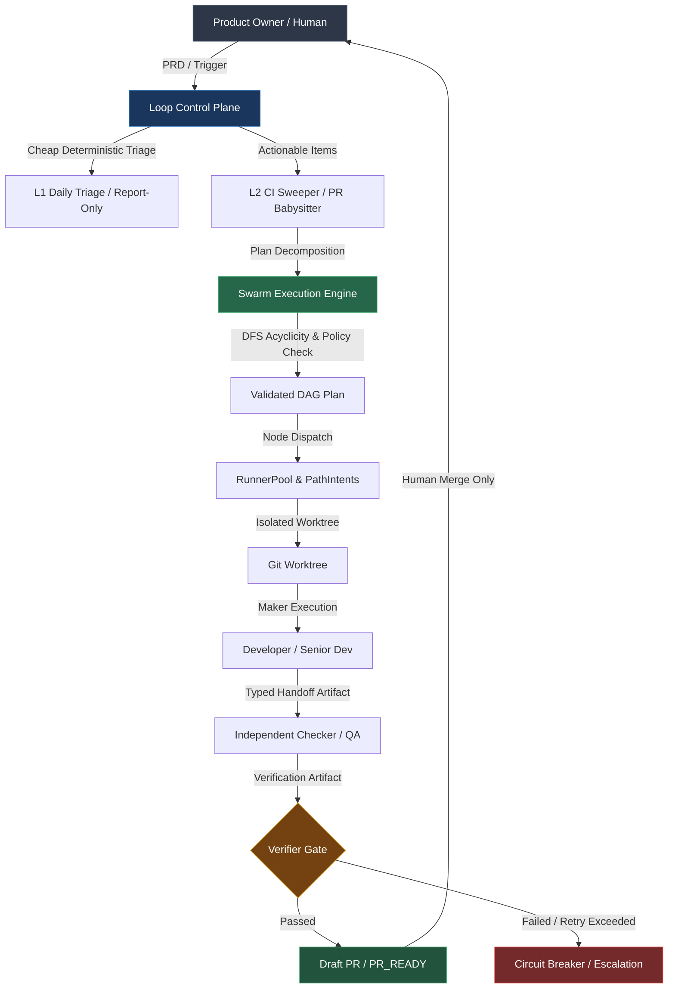
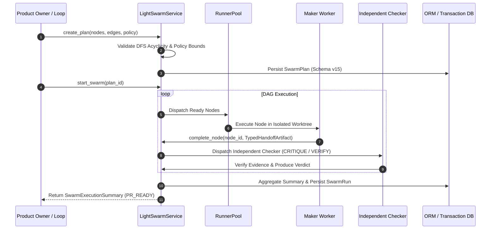

# LocalForge OS

LocalForge OS is an open-source, economy-aware AI software engineering control plane. It turns product specifications (PRDs) into sprint backlogs, routes work across a specialized agent squad, executes tasks in isolated Git worktrees, validates outputs through deterministic gates, performs bounded self-healing, and prepares pull requests for human review.

The official V6 contract and architectural specifications are documented in `docs/LocalForge_OS_PRD.md` and `docs/MASTER_BACKLOG_V6.md`.

---

## 🏛️ V6 Architecture Overview

LocalForge OS V6 decouples orchestration into two separate, complementary layers:

1. **Loop Control Plane**: Manages long-running operational loops, event triggers, triage logic, idempotency, circuit breakers, and autonomy levels (L0 to L3).
2. **Swarm Execution Engine**: Manages static (Light Swarm) and dynamic (Deep Swarm) DAG execution of bounded agent tasks with capability-aware `RunnerPool` dispatch, isolated worktrees, and typed evidence handoffs.




---

## 🤖 Squad Roles & Economy-First Routing

LocalForge routes each task to the cheapest tier empirically capable of performing it correctly. API models handle architecture, hard debugging, and high-risk reviews, while local models handle narrow execution under frozen contracts.

| Squad Role | System Role | Default Model Tier | Responsibility |
| --- | --- | --- | --- |
| **Product Owner** | Human User | Human | Defines requirements, reviews PRs, performs final merge |
| **Chief Engineer** | Master Orchestrator | API Large Model | Plans sprints, freezes contracts, triages hard failures |
| **Senior Developer** | High-risk Coder | API Medium/Large | Complex UI, architecture changes, multi-file refactoring |
| **Developer** | Bounded Coder | Local Medium Model | Single-file implementation under frozen contracts |
| **QA Engineer** | Tester | Local / Deterministic | Focused tests, verification, and artifact validation |
| **Bug Fixer** | Fast Repair | Local First, API Fallback | Repair syntax/import failures; escalate semantic errors |
| **Reviewer** | Acceptance Gate | API Large Model | Final contract-aware PR review |
| **PR Writer** | Documentarian | Local Small Model | PR summaries, changelog drafts, release evidence |
| **Safety Auditor** | Safety Kernel | Deterministic | Enforces budget, shell command rules, and file boundaries |

---

## 🔒 Autonomy Levels & Permanent Human-Merge Requirement

LocalForge operates under strict autonomy bounds. **Auto-merge is permanently disabled** — every generated pull request requires explicit human review and approval before merging into the main branch.

| Autonomy Level | Name | Allowed Operations | Human Requirement |
| --- | --- | --- | --- |
| **L0** | Manual | Inspect and propose actions; no automatic execution | Human triggers every step |
| **L1** | Inspect & Report | Inspect issues, PRs, and CI state; produce prioritized report | Zero repository or external mutations |
| **L2** | Draft-PR Workflow | Create isolated worktrees, fix allowlisted regressions, submit draft PRs | **Human review and merge required** |
| **L3** | Autonomous | Run continuous loops, create draft PRs, manage retry budgets | **Human review and merge required** |

> ⚠️ **CRITICAL SAFETY INVARIANT**: LocalForge agents will NEVER execute `git push --force`, merge directly to `main`, weaken failing unit tests, or bypass configured circuit breakers.

---

## 🔄 Supported Operational Loops

LocalForge OS V6 delivers three initial operational loops:

### 1. Daily Project Triage (L1)
- **Mode**: Report-Only (0 external mutations, $0.00 LLM cost on first-pass triage).
- **Function**: Inspects open issues, pull requests, and CI state.
- **Safety**: Deterministic triage neutralizes malicious prompt injections (`IGNORE_AND_LOG`) without policy escalation. Preserves `acting_on` idempotency state across restarts.

### 2. CI Sweeper (L2)
- **Mode**: Draft-PR Workflow.
- **Function**: Classifies CI failures into `CODE_REGRESSION`, `FLAKE`, `ENVIRONMENT`, `CONFIG`, `DEPENDENCY`, `UNKNOWN`.
- **Safety**: Automatically repairs **only** allowlisted `CODE_REGRESSION` failures in an isolated worktree under a max 3-attempt circuit breaker limit. Never weakends or deletes failing tests.

### 3. PR Babysitter (L2)
- **Mode**: Draft-PR Workflow.
- **Function**: Monitors PR review comments, requested changes, and mergeability.
- **Safety**: Deduplicates events, applies allowlisted small fixes, revalidates evidence when the upstream branch changes, and escalates merge conflicts without silent overwrites. Strictly prohibits self-approval or self-merge.

---

## ⚡ Swarm Execution Flow (Light Swarm)

The **Light Swarm Execution Engine** executes task plans as bounded Directed Acyclic Graphs (DAGs):



---

## 📊 Measured Phase 11 Evaluation Results

In Phase 11 comparative evaluations across controlled test fixture corpora, LocalForge OS demonstrated empirical superiority of the `LOOP_LIGHT_SWARM` strategy over single-worker baselines:

| Execution Strategy | PR_READY Rate | Recall | Execution Duration | Total Token Cost | Gate Verdict |
| --- | --- | --- | --- | --- | --- |
| **Single-Worker V5 Baseline** | 0.60 | 0.80 | 1200 ms | $0.4500 | `PARTIAL` |
| **Loop Single-Worker** | 0.80 | 0.95 | 800 ms | $0.3000 | `ACCEPTED` |
| **Loop Light Swarm** | **0.95** | **1.00** | **650 ms** | **$0.2500** | **`ACCEPTED`** |
| **Loop Deep Swarm (Experimental)** | 0.85 | 0.90 | 1800 ms | $0.8500 | `PARTIAL` |

> 📌 **NOTE**: Deep Swarm and semantic embeddings remain marked as **experimental** (`PARTIAL` verdict) because Light Swarm produces higher `PR_READY` rates at lower cost and latency on static task graphs.

---

## 🚀 Quickstart & Usage

### Prerequisites
- Python 3.11+
- Node.js 18+
- Git 2.40+

### Installation

```bash
# Clone the repository
git clone https://github.com/Masteradilio/local_forge_os.git
cd local_forge_os

# Install Python dependencies in virtualenv
python -m venv .venv
source .venv/bin/activate  # On Windows: .venv\Scripts\activate
pip install -e backend

# Install Frontend dependencies
npm install --prefix frontend
```

### Running the Control Plane

```bash
# Initialize database (auto-migrates up to Schema Version 15)
python manage.py bootstrap-db

# Run backend API server
python manage.py run-backend

# Run frontend UI
npm run dev --prefix frontend
```

### CLI Quickstart

```bash
# Run L1 Daily Project Triage (report-only, 0 cost)
localforge loops-eval triage

# Run L2 CI Sweeper auto-repair on a build failure
localforge loops-eval ci-sweeper --build-id 101

# Run strategy comparison matrix
localforge loops-eval compare

# Inspect provenance-aware memory facts
localforge memory list --project-id 1

# Manage Light Swarm execution
localforge swarm status --run-id 1
```

---

## 🧪 Validation & Regression Suite

Run targeted validation commands during development:

```bash
# Run backend Pytest suite (276+ tests)
python -m pytest backend/tests -q

# Run static type checker
python -m mypy backend

# Run frontend Vitest unit tests (5/5 tests)
npm test --prefix frontend

# Run frontend production build validation
npm run build --prefix frontend
```

---

## 📄 Key Documents

- `docs/LocalForge_OS_PRD.md` — Product Requirements Document
- `docs/MASTER_BACKLOG_V6.md` — Master V6 Engineering Backlog
- `CHANGELOG.md` — Complete V6 Implementation History
- `docs/e2e/v6/phase_11/acceptance_report.md` — Phase 11 Acceptance Report
- `docs/e2e/v6/v6_release_summary.json` — Official Release Summary
