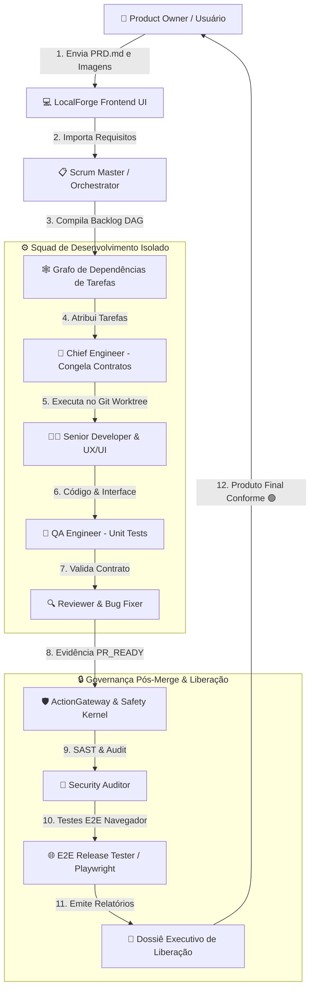

# 🛡️ LocalForge OS — Apresentação Conceitual e Funcional

> **Guia Executivo para Apresentação a Stakeholders**  
> *Plataforma de Engenharia de Software Autônoma, Local-First e Orientada a Squads de Inteligência Artificial.*

---

## 🏛️ Parte 1: Principais Conceitos e Tecnologias

O **LocalForge OS** é uma plataforma inovadora de Orquestração de Engenharia de Software impulsionada por IA. A plataforma combina a eficiência da IA local com a governança rígida da engenharia de software tradicional.

### 1.1 Conceitos-Chave de IA e Arquitetura

- **Squad de Agentes Especializados (10 Roles)**: Em vez de confiar em um único modelo genérico, o LocalForge opera com uma Squad composta por 10 papéis especializados (*Scrum Master*, *Chief Engineer*, *Senior Developer & UX/UI*, *Developer*, *QA Engineer*, *Bug Fixer*, *Reviewer*, *PR Writer*, *Security Auditor*, *E2E Release Tester*).
- **Arquitetura API-Led & Economy-First**: Economia inteligente de recursos. Tarefas delimitadas e simples são executadas localmente por modelos menores. O consumo de APIs de modelos superiores (como GPT-4o ou Claude 3.5) ocorre apenas sob demanda para decisões arquiteturais complexas ou escalações.
- **Model Context Protocol (MCP)**: Padrão aberto de integração que permite aos agentes conectar ferramentas locais, servidores de desenvolvimento, repositórios de código e bases de conhecimento com segurança.
- **Harness & Loop de Governança Determinística**: Mecanismo de segurança server-owned que exige a apresentação e validação atômica de evidências de teste (`gate_evidence`) antes que qualquer tarefa atinja o estado `PR_READY`.
- **Agent-Reach**: Capacidade de pesquisa multi-plataforma e extração resiliente de código e documentação web com custo de API zero.
- **UI/UX Pro Max System**: Motor de design integrado ao *Senior Developer* focado em estética moderna (paletas HSL, tipografia Google Fonts Inter/Outfit, glassmorphism e micro-animações) para evitar layouts genéricos.
- **Isolamento via Git Worktrees**: Cada tarefa é executada em uma ramificação isolada do Git (`task/<key>`), garantindo que alterações experimentais não corrompam a ramificação principal.

### 1.2 Tecnologias Utilizadas

- **Backend Core**: Python 3.11+, FastAPI (API REST), SQLAlchemy 2.0 (ORM Assíncrono), Pydantic v2 (Validação de Contratos), SQLite/aiosqlite (Persistência Leve).
- **Frontend & Interface**: React 19, Vite, TypeScript, TailwindCSS / Vanilla CSS de alta fidelidade.
- **Testes & Qualidade**: Vitest (Frontend Unit Tests), Pytest (Backend Unit Tests), Playwright (E2E Browser Driver), JSDOM (DOM Interaction Harness).

---

## 🔄 Parte 2: Fluxo Completo de Funcionamento

O ciclo de vida de desenvolvimento do LocalForge OS é 100% rastreável e auditável, operando em 6 etapas estruturadas:

### 2.1 As 6 Etapas da Esteira de Desenvolvimento

1. **Entrada do PO (User Intake)**:
   - O Product Owner (humano) envia o arquivo `PRD.md` e anexos visuais (mockups, protótipos em imagem) através da interface minimalista do LocalForge.
2. **Decomposição & Compilação DAG (Scrum Master)**:
   - O *Scrum Master* analisa o PRD e o protótipo visual, decompõe o produto em Epics/Tasks e constrói um Grafo Acíclico Dirigido (DAG) com todas as dependências de engenharia.
3. **Congelamento de Contratos & Execução Isolada**:
   - O *Chief Engineer* valida a arquitetura e congela os contratos de dados. Os desenvolvedores (*Senior Developer* e *Developer*) assumem cada tarefa em um Git Worktree isolado.
4. **Circuito de Qualidade & Revisão**:
   - O *QA Engineer* escreve e executa testes unitários. O *Bug Fixer* repara falhas de sintaxe e o *Reviewer* valida a conformidade do código antes de marcar a tarefa como pronta para Pull Request.
5. **Governança Pós-Merge & Segurança**:
   - Após a integração do código, o *Security Auditor* realiza a varredura de vulnerabilidades (SAST e vazamento de segredos) e o *E2E Release Tester* executa os testes funcionais de navegador via Playwright.
6. **Entrega do Produto & Dossiê Executivo**:
   - O sistema gera a versão final compilada do produto e emite o **Dossiê Executivo de Liberação** (`dossie_executivo_liberacao.md`), com o selo final de conformidade para o PO.

---

## 📊 2.2 Diagrama de Fluxo do Sistema (Mermaid)

---

## 🎯 Conclusão & Diferenciais Competitivos

- **Rastreabilidade Total**: Nenhuma linha de código é aceita sem evidências determinísticas.
- **Zero Alucinação em Produção**: A squad trabalha sob contratos estritos e checagens estáticas.
- **Custo-Efetivo e Privado**: Execução primária *local-first*, garantindo privacidade do código e baixíssimo consumo de tokens de nuvem.
