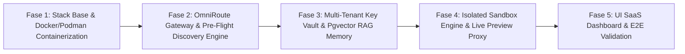

# 📋 Backlog de Implementação — ForgeOS Cloud

> **Roteiro de Execução Técnico para Evolução de LocalForge OS ➔ ForgeOS Cloud**  
> *Data de Criação: Julho/2026*

---

## 🎯 Visão Geral das Fases de Execução

---

## 🚀 Fase 1: Stack Base & Containerização (Docker Dev / Podman Prod)

- [ ] **Task 1.1**: Criar o `Dockerfile.omniroute` para empacotar o proxy OmniRoute AI Gateway baseado em Node.js 22.
- [ ] **Task 1.2**: Criar o `Dockerfile.backend` contendo a stack completa do ForgeOS Backend (Python 3.11, FastAPI, SQLAlchemy 2.0, Pydantic v2, Pytest, Playwright headless).
- [ ] **Task 1.3**: Criar o `Dockerfile.frontend` contendo o bundle Nginx servindo a interface web compilada em React 19 / Vite.
- [ ] **Task 1.4**: Escrever o `docker-compose.yml` para orquestração de testes locais no Windows Docker Engine (mapeando os 4 containers: `omniroute`, `backend`, `frontend`, `postgres-pgvector`).
- [ ] **Task 1.5**: Testar a subida limpa do ambiente via `docker-compose up --build` no Windows.

---

## 🛰️ Fase 2: OmniRoute Gateway & Pre-Flight Discovery Engine

- [ ] **Task 2.1**: Implementar o módulo `backend/forgeos/services/omniroute_client.py` conectando ao endpoint OpenAI-compatible (`http://omniroute:20128/v1`).
- [ ] **Task 2.2**: Criar o `backend/forgeos/discovery/engine.py` para consulta assíncrona ao catálogo de modelos (`GET /v1/models`).
- [ ] **Task 2.3**: Implementar o filtro de validação agêntica (`tools: true`, `json_schema: true`).
- [ ] **Task 2.4**: Implementar o ordenador de recência fina (diferença em dias desde `release_date`) e capacidade de parâmetros (ELO > 70B > 32B > 8B).
- [ ] **Task 2.5**: Implementar a injeção automática de Combos dinâmicos (`forge-high-tier`, `forge-mid-tier`) no OmniRoute via API antes de cada Run da Squad.
- [ ] **Task 2.6**: Atualizar os `SKILL.md` (System Prompts) de todos os 10 papéis da Squad incorporando as diretrizes de TDD (*Red-Green-Refactor*), fatiamento em *Tracer Bullets* e validação *Grill-with-docs* da biblioteca `mattpocock/skills`.
- [ ] **Task 2.7**: Configurar o servidor MCP **Context7 (`@upstash/context7-mcp`)** no `backend/forgeos/connectors/context7_mcp.py` para permitir pre-fetch automático de documentações atualizadas pelas bibliotecas especificadas no PRD.
- [ ] **Task 2.8**: Implementar o motor de **Interface Contracts First** no `Chief Engineer`, congelando arquivos de tipos (`.types.ts` / schemas Pydantic) antes do início da implementação pelos desenvolvedores.
- [ ] **Task 2.9**: Implementar a trava de escopo de arquivos (**File Scope Locking**) no validador do `Reviewer`, rejeitando diffs que alterem mais do que os 3-5 arquivos delimitados no contrato da tarefa.

---

## 🔑 Fase 3: Multi-Tenant Key Vault & HyperMemory Matrix (Graphify + MemPalace + Claude-Mem)

- [ ] **Task 3.1**: Configurar a extensão `pgvector` e ChromaDB no container de persistência do ForgeOS.
- [ ] **Task 3.2**: Criar as tabelas de domínio com isolamento por `tenant_id` e suporte a Row-Level Security (RLS).
- [ ] **Task 3.3**: Implementar o serviço `backend/forgeos/services/key_vault.py` com criptografia `AES-256-GCM` para armazenar chaves BYOK de usuários Pro.
- [ ] **Task 3.4**: Integrar o **Graphify (Tree-Sitter AST GraphRAG)** em `backend/forgeos/memory/graphify_engine.py` para gerar `GRAPH_REPORT.md` local com 0 tokens e permitir recontextualização instantânea na troca de LLMs.
- [ ] **Task 3.5**: Integrar o **MemPalace (Loci Vault)** em `backend/forgeos/memory/mempalace_service.py` para armazenar o histórico de decisões e código verbatim por projeto sem amnésia.
- [ ] **Task 3.6**: Integrar o **Claude-Mem Synthesizer** em `backend/forgeos/memory/rule_synthesizer.py` para capturar correções de usuários e falhas de testes, e **injetar/atualizar automaticamente o arquivo `AGENTS.md` e `GEMINI.md`** lido pelo Scrum Master e pela Squad.
- [ ] **Task 3.7**: Implementar o compilador de backlog do *Scrum Master* segundo o padrão *to-tickets / Tracer Bullets* (DB + API + UI + Test por ticket).

---

## 📦 Fase 4: Isolated Sandbox Engine & Proxy de Live Preview

- [ ] **Task 4.1**: Implementar o gerenciador de containers epêmeros `backend/forgeos/sandbox/container_runner.py` (usando a SDK do Docker no Windows e Podman no Linux).
- [ ] **Task 4.2**: Configurar os limites de hardware `cgroups v2` (1 vCPU, 1GB RAM, 5GB disk) e o modo rootless por execução.
- [ ] **Task 4.3**: Implementar o filtro de saída de rede (*Egress Whitelisting*) permitindo apenas registros oficiais de pacotes (`npmjs.org`, `pypi.org`, `github.com`).
- [ ] **Task 4.4**: Configurar o Traefik / Reverse Proxy para servir os servidores dev compilados no subdomínio de preview `https://<tenant>-<project>.preview.forgeos.app`.
- [ ] **Task 4.5**: Implementar o *Secret Scrubber* nos logs de execução do terminal, mascarando regex de segredos (`sk-`, `bearer`, `tokens`).
- [ ] **Task 4.6**: Implementar o **Compiler Feedback Loop** no `Bug Fixer`, enviando a saída exata do compilador (`tsc --noEmit` / `pyright`) com linha e arquivo para autocorreção determinística da Squad.
- [ ] **Task 4.7**: Implementar o congelamento estrito de dependências (**Strict Package Version Locking**) gerando `package-lock.json` / `uv.lock` na criação de novos repositórios.
- [ ] **Task 4.8**: Implementar o coletor de telemetria assíncrono **OpenTelemetry Tracing** no `backend/forgeos/observability/tracer.py` registrando tempo de resposta e ferramentas por papel da Squad.
- [ ] **Task 4.9**: Implementar os pontos de interrupção **Human-in-the-Loop (HITL Gates)** no `backend/forgeos/pipeline/hitl_engine.py` permitindo pausar a execução para aprovação do PO.
- [ ] **Task 4.10**: Implementar a **Agent Authority Matrix Completa dos 10 Papéis** no `backend/forgeos/safety/authority_matrix.py` (interceptando o `ActionGateway` para restringir permissões de escrita de arquivos e execução de ferramentas estritamente conforme a tabela de governança de papéis).

---

## 🌐 Fase 5: UI SaaS Dashboard & Validação E2E Final

- [ ] **Task 5.1**: Atualizar a interface do Frontend no Menu 1 para suporte a autenticação Multi-Tenant e upload de PRD/Anexos em nuvem.
- [ ] **Task 5.2**: Adicionar visualizador no Menu 5 para o link de **Live Preview** da aplicação compilada no Sandbox.
- [ ] **Task 5.3**: Adicionar aba de configurações de chaves BYOK (opcional) no painel do usuário.
- [ ] **Task 5.4**: Implementar o componente de linha do tempo visual (**Tracing Timeline Component**) no Frontend React exibindo o fluxo de execução e latência dos papéis.
- [ ] **Task 5.5**: Implementar o modal de **Dynamic User Input** e aprovação HITL no chat com o PO.
- [ ] **Task 5.6**: Executar bateria E2E completa no Docker Windows testando o pipeline da Squad sob o novo motor OmniRoute Free Tier.
- [ ] **Task 5.7**: Emitir o Dossiê Executivo de Liberação final da versão **ForgeOS Cloud 1.0.0**.
