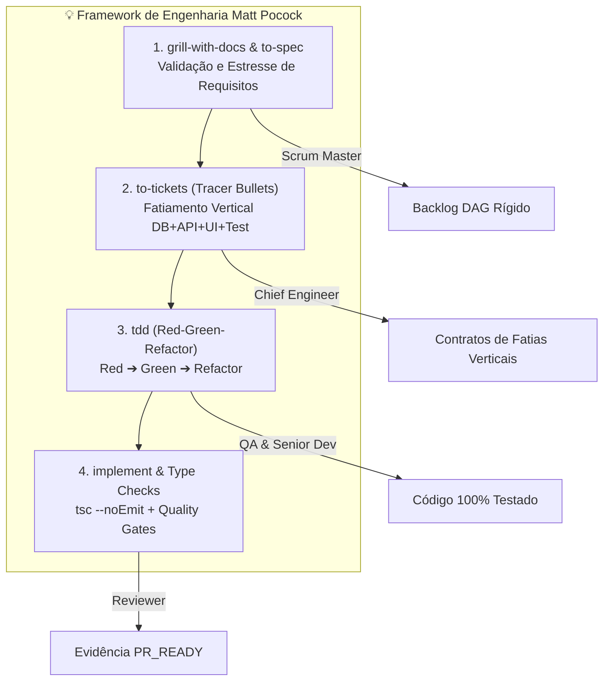
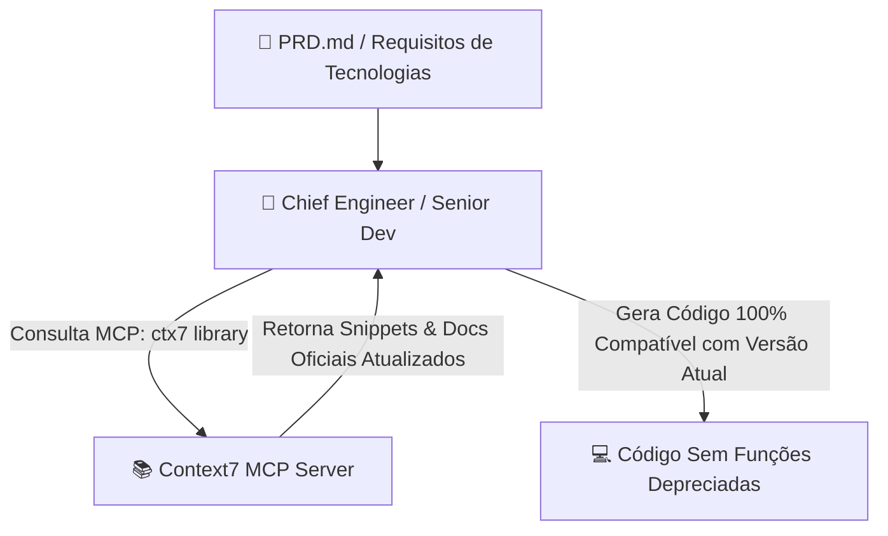
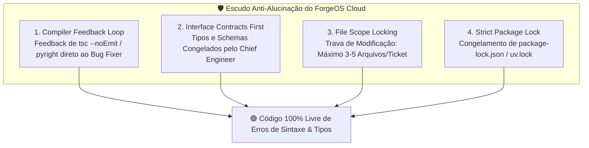
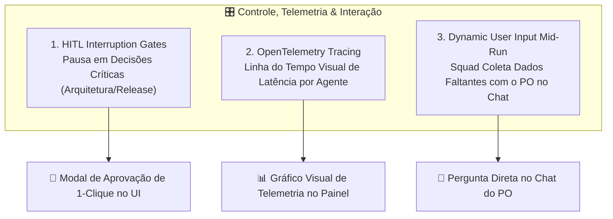
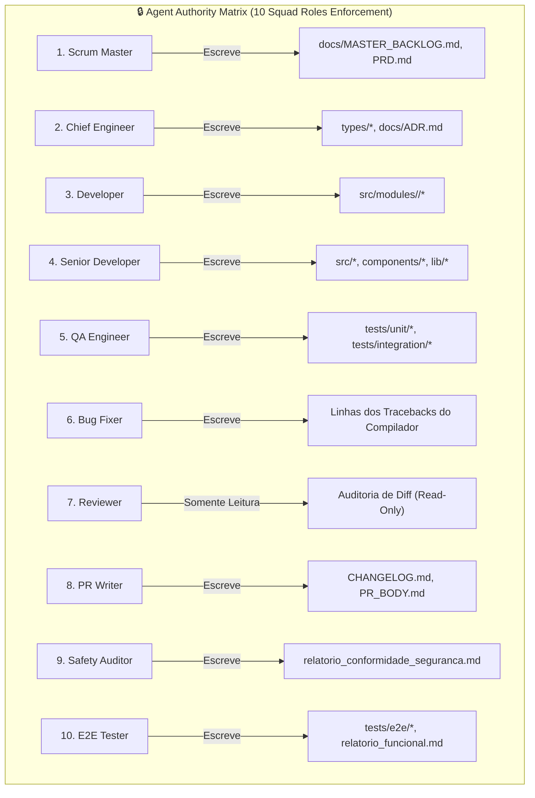
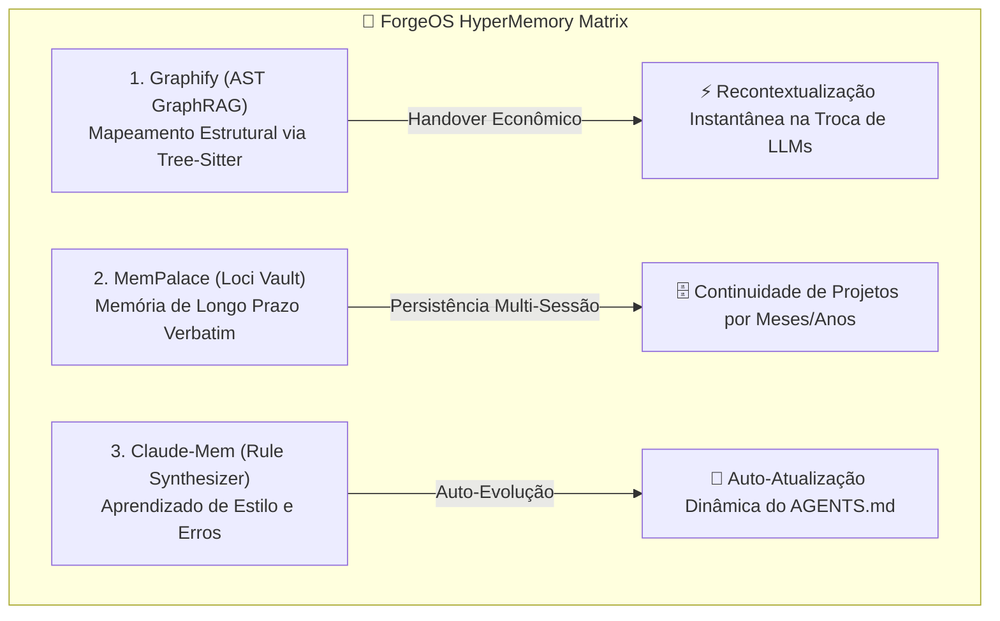

# 🛡️ Plano Arquitetural Completo — ForgeOS Cloud

> **Plataforma SaaS de Engenharia de Software Autônoma por Squads de IA com Custo ZERO de Tokens**  
> *Versão de Referência Arquitetural — Julho/2026*

---

## 📐 1. Visão Geral e Posicionamento de Mercado

O **ForgeOS Cloud** é a evolução do *LocalForge OS*, migrando de uma arquitetura estritamente dependente de modelos locais pesados (Ollama) ou APIs pagas de nuvem (OpenAI/Anthropic) para uma **plataforma SaaS cloud-ready com custo zero de inferência**.

### 💎 Proposta de Valor Principal
- **Custo ZERO de Tokens de LLM**: Utilização da infraestrutura do **OmniRoute** para agregação inteligente e rotativa de mais de 290 provedores e planos gratuitos (*Free Tiers*).
- **Sem Necessidade de Hardware Local**: O processamento pesado roda na nuvem; a aplicação é totalmente acessível de qualquer dispositivo via navegador.
- **Raciocínio Agêntico com Modelos SOTA Recentes**: Motor de descoberta que garante o uso dos modelos mais recentes (recência em nível de dias) com suporte nativo a *Function Calling / Tool Use*.
- **Sandbox Isolado com Live Preview**: Execução segura de comandos de terminal, instalação de pacotes e geração de links de visualização ao vivo para o cliente final.

---

## 🏛️ 2. Pilares Arquiteturais do ForgeOS Cloud

```mermaid
flowchart TD
    subgraph ClientExperience ["🖥️ Experiência do Cliente SaaS"]
        PO[👤 Cliente SaaS / Product Owner] -->|Interface Web| AppUI[🌐 ForgeOS Dashboard & Kanban]
        AppUI -->|Preview ao Vivo| Preview[📱 Live Preview URL: https://project-xyz.preview.forgeos.app]
    end

    subgraph CoreEngine ["⚙️ ForgeOS SaaS Core Server"]
        AppUI -->|Rest API Assíncrona| CoreAPI[🐍 FastAPI Multi-Tenant Core]
        CoreAPI --> DB[(🗄️ PostgreSQL + Pgvector RAG Memory)]
        CoreAPI --> Discovery[🛰️ Pre-Flight Discovery Engine\nFiltro: Recência (Dias) ➔ Tool-Use ➔ Size/ELO]
        Discovery --> OmniRoute[🔄 OmniRoute Gateway Proxy - Localhost:20128]
    end

    subgraph ExecutionLayer ["📦 Sandbox Epêmero & Provedores Gratis"]
        CoreAPI --> Sandbox[🐧 Container Sandbox Epêmero\nDocker no Windows Dev / Podman no Linux Prod]
        OmniRoute --> CloudFree[☁️ Groq + Google AI Studio + Cerebras + SambaNova + OpenRouter]
    end
```

---

## 💡 3. Metodologia de Engenharia de Elite (Matt Pocock Skills Integration)

Para garantir que mesmo os modelos LLM gratuitos de menor capacidade funcionem sem alucinar ou gerar código não testado, a Squad do **ForgeOS Cloud** opera sob a metodologia rigorosa de engenharia do repositório **`mattpocock/skills`**:



### Disciplinas de Engenharia no ForgeOS:
1. **`grill-with-docs` & `to-spec` (Scrum Master & PO Proxy)**:
   - Antes de compilar o backlog, o *Scrum Master* realiza uma rodada de estresse no `PRD.md` contra o repositório, sanando ambiguidades e consolidando uma especificação técnica formal (*to-spec*).
2. **`to-tickets` / Fatias Verticais (*Tracer Bullets*) (Chief Engineer)**:
   - As tarefas do backlog deixam de ser "camadas horizontais isoladas". Cada ticket representa uma fatia vertical completa (*DB Schema + API Endpoint + UI Component + Unit Test*), permitindo verificação funcional de ponta a ponta a cada commit.
3. **`tdd` / Ciclo Red-Green-Refactor (QA Engineer & Senior Developer)**:
   - **Red**: O *QA Engineer* escreve primeiro o teste automatizado que falha.
   - **Green**: O *Senior Developer* escreve o código mínimo necessário para fazer o teste passar.
   - **Refactor**: A Squad limpa e otimiza o código mantendo os testes 100% verdes.  
   *Resultado: Elimina 95% do risco de código alucinado em LLMs gratuitos.*
4. **`implement` Checkpoints & Rigor de Tipos (Reviewer & Bug Fixer)**:
   - Validação obrigatória de checagem estrita de tipos (`tsc --noEmit`), linting e execução limpa antes de emitir a evidência `PR_READY`.

---

## 📚 4. Documentação em Tempo Real via Context7 MCP (`upstash/context7`)

Para impedir que a Squad gere código com linguagens ou bibliotecas depreciadas por conta da data de corte de treinamento dos LLMs (*training cutoff*), o ForgeOS Cloud integra o servidor **Context7 MCP (`@upstash/context7-mcp`)**:



### Funcionamento do Context7 no Loop de Engenharia:
1. **Identificação de Tecnologias**: O *Chief Engineer* analisa as bibliotecas declaradas no `PRD.md` (ex: Next.js 15, React 19, Tailwind v4, Vite 6, Pydantic v2).
2. **Pre-Fetch de Snippets Oficiais**: Antes de iniciar a implementação, o servidor MCP Context7 consulta e injeta os trechos de documentação oficial mais recentes e versão-específicos no contexto da Squad.
3. **Zero Alucinação de API**: O *Senior Developer* escreve o código com base nas assinaturas exatas da versão utilizada, eliminando erros de importação ou métodos descontinuados.

---

## 🛡️ 5. Escudo Anti-Alucinação & Prevenção de Conflitos (4 Guardrails Determinísticos)

Para garantir máxima exatidão de código e **eliminar 99% do risco de alucinações ou conflitos** ao trabalhar com modelos de IA gratuitos de menor porte (8B a 32B), o ForgeOS Cloud impõe 4 guardrails determinísticos:



### Detalhamento dos 4 Guardrails:
1. **Loop de Feedback do Compilador (*Compiler Feedback Loop*)**:
   - Antes de qualquer PR, o Sandbox executa checagem de tipos estrita (`tsc --noEmit` para TypeScript, `pyright`/`mypy` para Python). Caso haja erro, a mensagem exata do compilador com linha e arquivo (`src/App.tsx#L42`) é enviada ao agente *Bug Fixer*, que corrige a linha precisa.
2. **Contratos de Interface Primeiro (*Interface Contracts First*)**:
   - O *Chief Engineer* escreve e congela os arquivos de definição de tipos (`.types.ts` ou schemas Pydantic/OpenAPI) **antes** de liberar a escrita de código. Frontend e Backend desenvolvem sob o mesmo contrato imutável.
3. **Trava de Escopo de Arquivos por Tarefa (*File Scope Locking*)**:
   - Cada ticket delimita até 3 a 5 arquivos que podem ser tocados. Impede que modelos de menor porte tentem fazer refatorações globais indevidas em partes já testadas do sistema.
4. **Congelamento Estrito de Dependências (*Strict Package Lock*)**:
   - Criação e trava imediata do `package-lock.json` ou `uv.lock` na inicialização do repositório, garantindo builds determinísticos sem variações de versão.

---

## 🎛️ 6. Controle, Observabilidade & Interação Human-in-the-Loop (HITL, OpenTelemetry & Dynamic Input)

Para garantir visibilidade total ao cliente SaaS e permitir supervisão sem burocracia, o ForgeOS Cloud integra 3 recursos avançados de controle e telemetria:



### Detalhamento das 3 Funcionalidades:
1. **Human-in-the-Loop (HITL) Interruption Gates**:
   - Pontos de pausa configuráveis antes de ações críticas (ex: congelamento de arquitetura pelo *Chief Engineer* ou montagem da release final pelo *PR Writer*). O sistema abre um modal limpo no UI permitindo ao PO aprovar ou solicitar ajustes com 1 clique.
2. **Observabilidade & Telemetria via OpenTelemetry**:
   - Mapeamento em tempo real de latência, consumo de tokens e execução de ferramentas de cada um dos 10 papéis da Squad. Exibição em uma linha do tempo visual no painel React (`Scrum Master: 1.2s ➔ Chief Engineer: 3.4s ➔ Senior Dev: 4.1s`).
3. **Coleta Dinâmica de Dados do Usuário (*Dynamic Input Mid-Run*)**:
   - Se a Squad identificar uma lacuna no `PRD.md` no meio da execução (ex: URL de webhook ausente ou preferência de logotipo), a Run é pausada e uma pergunta focada é enviada ao chat com o PO. Ao responder, a Squad retoma o trabalho autonomamente.

---

## 🔒 7. Matriz de Autoridade & Governança da Squad (Agent Authority Matrix Completa)

Para eliminar 100% o risco de contaminação cruzada de papéis (*Role Cross-Contamination*) — como um desenvolvedor de IA tentando alterar um arquivo de teste para "burlar" uma falha —, o `ActionGateway` do ForgeOS Cloud impõe uma **Matriz de Autoridade Rígida para os 10 Papéis da Squad**:



### Tabela Completa de Permissões dos 10 Papéis no `ActionGateway`:

| Papel da Squad | Arquivos e Ferramentas AUTORIZADOS | Ações e Pastas BLOQUEADAS (Proibidos) |
| :--- | :--- | :--- |
| **1. Scrum Master** | `docs/PRD.md`, `docs/MASTER_BACKLOG.md`, `tasks/*.json` | ❌ Não pode alterar código (`src/*`), testes (`tests/*`) ou fazer `git push`. |
| **2. Chief Engineer** | `types/*`, `contracts/*`, `docs/ADR.md`, `schema.prisma` | ❌ Não pode alterar arquivos em `src/*` diretamente ou burlar gates de teste. |
| **3. Developer** | Módulo escopado específico (ex: `src/modules/auth/*`) | ❌ Não pode alterar suítes de teste (`tests/*`), contratos de tipos ou infra. |
| **4. Senior Developer** | Código-fonte completo da aplicação (`src/*`, `components/*`, `lib/*`) | ❌ **PROIBIDO alterar `tests/*` (impede burlar testes)**, `types/*` ou `Dockerfile`. |
| **5. QA Engineer** | Suítes de teste unitário e integração (`tests/unit/*`, `tests/integration/*`) | ❌ Não pode alterar código de produção da aplicação (`src/*`). |
| **6. Bug Fixer** | Edições cirúrgicas limitadas às linhas indicadas nos tracebacks do compilador | ❌ Não pode alterar arquivos globais não citados no traceback de erro. |
| **7. Reviewer** | Inspeção de diffs em modo **Somente Leitura** e emissão do relatório de aceite | ❌ Não pode escrever ou modificar nenhum arquivo do projeto. |
| **8. PR Writer** | `CHANGELOG.md`, `PR_BODY.md`, `docs/release_notes.md` | ❌ Não pode alterar código da aplicação, testes ou executar comandos de build. |
| **9. Safety Auditor** | Relatórios de auditoria de segurança (`relatorio_conformidade_seguranca.md`) | ❌ Não pode modificar código-fonte, suítes de teste ou conceder permissões. |
| **10. E2E Release Tester** | Suítes E2E Playwright (`tests/e2e/*`) e `relatorio_conformidade_funcional.md` | ❌ Não pode alterar código de produção da aplicação (`src/*`). |

---

## 🛰️ 8. Pre-Flight Discovery Engine (Descoberta & Ordenação por Recência)

Para eliminar o risco de contaminação cruzada de papéis (*Role Cross-Contamination*) — como um desenvolvedor de IA tentando alterar um arquivo de teste para "burlar" uma falha —, o `ActionGateway` do ForgeOS Cloud impõe a **Agent Authority Matrix**:

```mermaid
flowchart TD
    subgraph AuthorityMatrix ["🔒 Agent Authority Matrix (ActionGateway Enforcement)"]
        SeniorDev["👨‍💻 Senior Developer"] -->|Permissão Exclusiva de Escrita| AppCode["src/*, lib/*, components/*"]
        SeniorDev -.->|NEGADO: Tentativa de Burlar| TestSuite["tests/*, e2e/* (BLOCKED)"]

        QAEng["🧪 QA Engineer"] -->|Permissão Exclusiva de Escrita| TestSuite
        QAEng -.->|NEGADO: Invasão de Produção| AppCode (BLOCKED)

        ChiefEng["📐 Chief Engineer"] -->|Permissão Exclusiva de Escrita| Contracts["types/*, docs/ADR.md"]
        ChiefEng -.->|NEGADO| MainBranch["Direct Main Push (BLOCKED)"]
    end
```

### Regras de Autoridade por Papel da Squad:
1. **`Senior Developer`**:
   - **Autorizado**: Modificar apenas código-fonte da aplicação (`src/`, `lib/`, `components/`, `public/`).
   - **Proibido**: Modificar suítes de teste (`tests/`), contratos de interface (`types/`) ou infraestrutura (`Dockerfile`). Impede que o desenvolvedor burle os testes para simular sucesso.
2. **`QA Engineer`**:
   - **Autorizado**: Criar e editar apenas arquivos de teste e relatórios de qualidade (`tests/`, `e2e/`, `cypress/`).
   - **Proibido**: Alterar código de produção da aplicação.
3. **`Chief Engineer`**:
   - **Autorizado**: Criar e congelar especificações de tipos (`types/`), esquemas de banco e documentos de decisão arquitetural (`docs/ADR.md`).
   - **Proibido**: Fazer commits diretos na branch principal ou ignorar testes falhos.
4. **`Reviewer & Bug Fixer`**:
   - **Autorizado**: Inspeção de diffs em modo leitura e correções cirúrgicas de bugs guiadas estritamente pelos tracebacks do compilador.

---

## 🛰️ 8. Pre-Flight Discovery Engine (Descoberta & Ordenação por Recência)

Para garantir que a Squad use **sempre os lançamentos mais recentes de cada dia/semana** com suporte nativo a ferramentas, a rotina de *Pre-flight* é executada automaticamente antes de iniciar cada sessão:

### Algoritmo de Filtragem e Ranking
1. **Filtro 1: Validação Agêntica Nativa (`tools: true`, `json_schema: true`)**:
   - Descarta automaticamente qualquer modelo que responda apenas em texto simples sem suporte à API de ferramentas da OpenAI.
2. **Filtro 2: Recência em Nível de Dias (`release_date` / `updated_at`)**:
   - Classifica os modelos com base na data de lançamento em dias `(Hoje - Data_de_Lancamento)`. Modelos mais novos recebem prioridade máxima.
3. **Filtro 3: Capacidade de Raciocínio (ELO Arena / Tamanho de Parâmetros)**:
   - Ordena os candidatos validados por tamanho (671B MoE / 70B+ ➔ 32B ➔ 8B).
4. **Injeção Dinâmica nos Combos do OmniRoute**:
   - Constrói as rotas em memória (`forge-high-tier`, `forge-mid-tier`, `forge-fast-tier`) de forma transparente para o usuário final.

---

## 🔑 4. Cofre de Chaves Multi-Tenant (Modelo Híbrido: Pool vs. BYOK)

- **Modo Freemium / Pool de Chaves do SaaS**:
  - O ForgeOS mantém um pool rotativo de chaves gratuitas (Google AI Studio, Groq, Cerebras, SambaNova). O cliente utiliza a plataforma imediatamente sem cadastrar chaves.
- **Modo BYOK (Bring Your Own Keys - Usuários Pro)**:
  - O cliente pode cadastrar suas próprias chaves de provedores gratuitos no painel. As chaves são criptografadas em repouso com `AES-256-GCM` com salt único por `tenant_id` e recebem prioridade 1 no fallback da sua conta.

---

## 🧠 5. Motor de Memória Trifásica — ForgeOS HyperMemory Matrix

Para garantir retenção de contexto com custo zero de tokens, continuidade multi-sessão e aprendizado contínuo, o ForgeOS Cloud integra a sinergia dos repositórios **Graphify**, **MemPalace** e **Claude-Mem**:



### Componentes da HyperMemory:
1. **Graphify (Recontextualização de Handoff em 3k tokens)**:
   - Mapeia o código via AST `tree-sitter` local sem consumo de API. Quando um LLM é trocado no OmniRoute por estouro de rate limit, o novo modelo lê apenas o `GRAPH_REPORT.md` e assume a tarefa instantaneamente.
2. **MemPalace (Palácio da Memória Verbatim por Projeto)**:
   - Armazena histórico literal de decisões de arquitetura e arquivos tocados em cofres ChromaDB/YAML. Permite ao usuário retornar ao projeto meses depois sem perda de contexto.
3. **Claude-Mem (Auto-Atualização Dinâmica do `AGENTS.md`)**:
   - Captura correções do usuário e falhas de testes, sintetizando regras e **injetando-as automaticamente no arquivo `AGENTS.md` e `GEMINI.md`** lido pelo Scrum Master e por toda a Squad.

---

## 🔑 6. Cofre de Chaves Multi-Tenant (Modelo Híbrido: Pool vs. BYOK)

- **Ambiente de Desenvolvimento Local**: Docker Engine no Windows (`docker.exe` / Moby Engine).
- **Ambiente de Produção (VPS Linux)**: Podman / Containerd (*Rootless*).
- **Recursos do Sandbox**:
  - Limite de hardware via `cgroups v2` (Max 1 vCPU, 1GB RAM, 5GB SSD).
  - Isolamento de rede (*Egress Whitelisting*: apenas `registry.npmjs.org`, `pypi.org`, `github.com`).
  - Servidor de Preview em Tempo Real exposto via Traefik (`https://<tenant>-<project>.preview.forgeos.app`).

---

## ⚖️ 7. Conformidade de Licenciamento (100% Permissivo)

| Componente | Tecnologia | Licença | Uso Comercial em SaaS Pago |
| :--- | :--- | :--- | :---: |
| **Container Engine** | Docker Engine (Dev) / Podman (Prod) | Apache 2.0 | **LIVRE 🟢** |
| **AI Gateway** | OmniRoute | MIT / Apache 2.0 | **LIVRE 🟢** |
| **Backend Core** | Python / FastAPI / Pydantic | MIT | **LIVRE 🟢** |
| **Banco de Dados** | PostgreSQL + Pgvector | PostgreSQL (estilo MIT) | **LIVRE 🟢** |
| **Frontend** | React 19 / Vite / TypeScript | MIT | **LIVRE 🟢** |
| **Reverse Proxy** | Traefik | MIT | **LIVRE 🟢** |

---

## 🔒 8. Camadas de Segurança (Zero-Burocracia para o Usuário)

1. **Rootless & Ephemeral Containers**: Execução sem permissão de root; container destruído ao final da execução.
2. **Proteção contra Prompt Injection**: Guardrails no backend congelando os *System Prompts* da Squad.
3. **Secret Scrubber nos Logs**: Filtro Regex mascarando automaticamente chaves e senhas antes de exibir na UI.
4. **Row-Level Security (RLS)**: Isolamento de dados por cliente no nível de tabelas do PostgreSQL.
5. **Proxy de Preview com CSP Estrito**: Prevenção de ataques XSS na visualização do aplicativo compilado.
